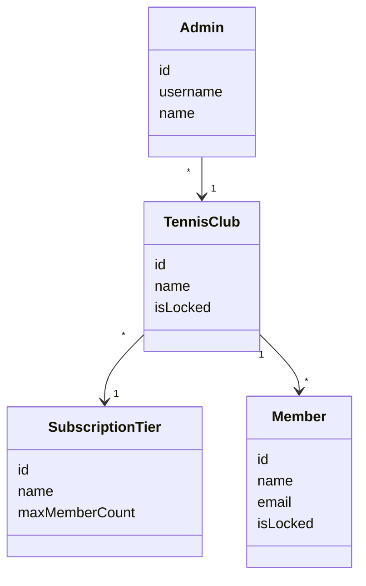

# ClubService

Microservice to manage Tennis Clubs and their members.

## Domain Model

## Login

In our application we distinguish between `Members` and `Admins`. Both are accounts that users of the application can login with.
Members use their email address as login while Admins have a username. Since it's theoretically possible that a user would be
member or admin of multiple tennis clubs, the login details (i.e. emails and usernames) only have to be unique within one tennis club.
This means for a login we have to provide a username (which can be an actual username or an email) and the associated tennis club.
In a real world the user wouldn't need to select the tennis club, as we imagined each tennis club to have it's own page, which 
would also allow for individual branding. 

Once the credentials are sent to the backend, we check if it is an Admin or a Member and load the correct user form the database by 
using the unique combination of username and tennis club Id. Once we loaded the correct user, we can verify the password in our login db.