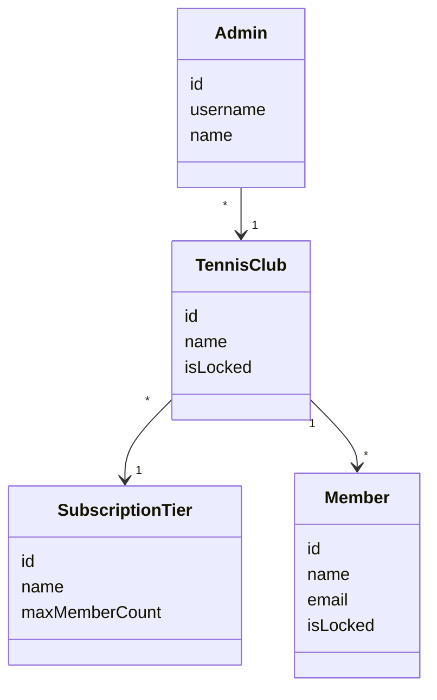

# ClubService

Microservice to manage Tennis Clubs and their members.

## Domain Model

```mermaid
classDiagram
class TennisClub {
    id
    name
    isLocked
}

class Member {
    id
    name
    email
    isLocked
}

class Admin {
    id
    username
    name
}

class SubscriptionTier {
    id
    name
    maxMemberCount
}

TennisClub "*" --> "1" SubscriptionTier
TennisClub "1" --> "*" Member
Admin "*" --> "1" TennisClub
```