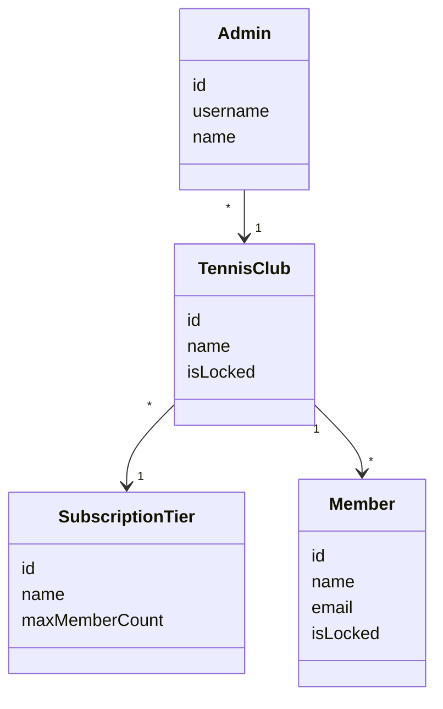

# ClubService
[](https://sonarcloud.io/summary/new_code?id=THC-Software_ClubService)
[](https://sonarcloud.io/summary/new_code?id=THC-Software_ClubService)
[](https://sonarcloud.io/summary/new_code?id=THC-Software_ClubService)
[](https://sonarcloud.io/summary/new_code?id=THC-Software_ClubService)
[](https://sonarcloud.io/summary/new_code?id=THC-Software_ClubService)

Microservice to manage Tennis Clubs and their members.

## Domain Model


## Login

In our application we distinguish between `Members`, `Admins`, and `Supervisors`. All of them are accounts that users of the application can login with.
Members use their email address as login while Admins have a username. Since it's theoretically possible that a user would be
member or admin of multiple tennis clubs, the login details (i.e. emails and usernames) only have to be unique within one tennis club.
This means for a login we have to provide a username (which can be an actual username or an email) and the associated tennis club.
In a real world the user wouldn't need to select the tennis club, as we imagined each tennis club to have it's own page, which 
would also allow for individual branding. 

Once the credentials are sent to the backend, we check if it is an Admin or a Member and load the correct user form the database by 
using the unique combination of username and tennis club Id. Once we loaded the correct user, we can verify the password in our login db.

Supervisors also have a username as login, they do not belong to any club as they are used to supervise all Tennisclubs.
Therefore, if no TennisclubId is provided when logging in, we assume the user to be a Supervisor.


## Domain Driven Design

DDD was used in this project. The following aggregates exist:
- Member
- Admin
- SystemOperator
- SubscriptionTier
- TennisClub
- UserPassword

Additionally, Event Sourcing was used, therefore those Entities all provide a `process` and a `apply` method. 
Process is used to create an Event from a Command, which can then be applied on this Entity. It's important that `apply` always
works if `process` works. 

## Event Sourcing

To give an example of events, lets take a look at the member events.
Each event for the member entities is prefixed with `Member`, all of those events implement the `IMemberDomainEvent` interface,
which in turn implements the `IDomainEvent` interface, which is implemented by all event interfaces.
Furthermore, we created a `DomainEnvelope`, which adds metadata to the Events such as a `Timestamp`, `EventType`, and `EntityType`.
This is also what gets persisted in the database. Since event sourcing is used, the database is append only, events cannot be deleted.

### Optimistic Locking

We implemented optimistic locking directly in the insert sql query.
```c#
   private const string InsertSqlQuery = @"
        INSERT INTO ""DomainEvent""(""eventId"", ""entityId"", ""eventType"", ""entityType"", ""timestamp"", ""eventData"")
        SELECT @eventId, @entityId, @eventType, @entityType, @timestamp, @eventData
        WHERE (SELECT COUNT(*) FROM ""DomainEvent"" WHERE ""entityId"" = @entityId) = @expectedEventCount;
    ";
```
This is done by counting the number of events before the insert, if the `expectedEventCount` is not correct the whole query fails.
Therefore guaranteeing a consistent state.

### Debezium

Once an event gets persisted in the database Debezium publishes it to the redis stream.
The event-data of the published message is located in `payload.after`. Debezium also guarantees that the order of the published
messages is correct by using transaction log tailing.

### Handling Events

#### Redis Event Reader

The `RedisEventReader` is registered as background service, messages are polled in a 1s intervall. 
We define which streams and which messages of which streams are relevant for us in the appsettings.json
```json
"RedisConfiguration": {
    "Host": "localhost:6379",
    "PollingInterval": "1",
    "Streams": [
      {
        "StreamName": "club_service_events.public.DomainEvent",
        "ConsumerGroup": "club_service_events.domain.events.group",
        "DesiredEventTypes": [
          "*"
        ]
      },
      {
        "StreamName": "tournament_events.public.technicaleventenvelope",
        "ConsumerGroup": "tournament_service_events.domain.events.group",
        "DesiredEventTypes": [
          "TOURNAMENT_CONFIRMED",
          "TOURNAMENT_CANCELED"
        ]
      }
    ]
  }
```
In our case we listen to all of our own events and additionally to the `TOURNAMENT_CONFIRMED` and `TOURNAMENT_CANCELLED`
events of the tournament service. If the event that the stream provides us with is in the `DesiredEventTypes`, we hand
it to the `ChainEventHandler`

#### Chain Event Handler

We've implemented a chain event handler that has a list of event handlers. Each event handler corresponds to one event type.
All events are passed to the chain event handler and it in turn passes them further to all of the event handlers that are registered with it.
If the event is supported in the event handler that it is passed to, it will process that event (e.g. construct the readside or send an email)

#### Duplicate Messages

To guarantee idempotency, we track which events have already been handled. This is also done in the chain event handler.
The id of the processed event is saved in a `ProcessedEventRepository`. Both the handling of the event and the persisting of the
processed event id happen in the same transaction therefore we can guarantee that no event is handled twice.

```c#
        await transactionManager.TransactionScope(async () =>
        {
            foreach (var eventHandler in eventHandlers)
            {
                await eventHandler.Handle(domainEnvelope);
            }

            var processedEvent = new ProcessedEvent(domainEnvelope.EventId);
            await processedEventRepository.Add(processedEvent);
        });
```

## Sagas

we are just part of a Saga but did not have to implement one ourselves
//TODO more on saga

## Authorization

The authentication is done in the API gateway, in the tennisclub service we only verify that the user is allowed to perform the action
based on the tennis club they are part of and/or the account they have.
Example: Member can only change details for his own account, Admin can only lock members that are part of same tennisclub and so on.

## CI/CD + Development

For the whole project we used Sonarcloud with a github runner pipeline that automatically runs sonarcloud + all of the tests.
The main branch was locked and pull requests + code reviews were done for each merge to main. Furthermore, the pipeline had to 
run and pass the quality gates set in sonarcloud.


## Infrastructure

The application consists of 5 containers:

- Tennis Club Service
- Postgresql
- Debezium
- Redis
- Mailhog

Of course Redis will only be running once in the whole microservice infrastructure.

### Docker

For the beginning of the project we deployed everything with docker. We created a dockerfile for our service:
```dockerfile
FROM mcr.microsoft.com/dotnet/aspnet:8.0 AS base
USER $APP_UID
WORKDIR /app
EXPOSE 8080
EXPOSE 8081

FROM mcr.microsoft.com/dotnet/sdk:8.0 AS build
ARG BUILD_CONFIGURATION=Release
WORKDIR /src
COPY ["ClubService.API/ClubService.API.csproj", "ClubService.API/"]
COPY ["ClubService.Application/ClubService.Application.csproj", "ClubService.Application/"]
COPY ["ClubService.Domain/ClubService.Domain.csproj", "ClubService.Domain/"]
COPY ["ClubService.Infrastructure/ClubService.Infrastructure.csproj", "ClubService.Infrastructure/"]
RUN dotnet restore "ClubService.API/ClubService.API.csproj"
COPY . .
WORKDIR "/src/ClubService.API"
RUN dotnet build "ClubService.API.csproj" -c $BUILD_CONFIGURATION -o /app/build

FROM build AS publish
ARG BUILD_CONFIGURATION=Release
RUN dotnet publish "ClubService.API.csproj" -c $BUILD_CONFIGURATION -o /app/publish /p:UseAppHost=false

FROM base AS final
WORKDIR /app
COPY --from=publish /app/publish .

ENV POSTGRES_HOST=localhost
ENV POSTGRES_PORT=5432
ENV POSTGRES_USER=user
ENV POSTGRES_PASSWORD=password
ENV EVENT_STORE_DB=club-service-event-store
ENV READ_STORE_DB=club-service-read-store
ENV LOGIN_STORE_DB=club-service-login-store
ENV REDIS_HOST=localhost
ENV REDIS_PORT=6379
ENV SMTP_HOST=localhost
ENV SMTP_PORT=1025
ENV SMTP_SENDER_EMAIL_ADDRESS=admin@thcdornbirn.at

ENTRYPOINT ["dotnet", "ClubService.API.dll"]
```
A build container is used to build the software which is then deployed in the base container.
This is then used in the docker-compose file to start the tennis club service and all of the other containers, making it
easy to start the whole application.

### Kubernetes

## Sending Emails